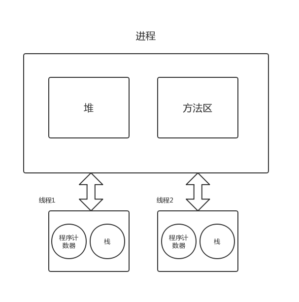

# 并发编程线程基础

# 目录

- [线程和进程的区别](#线程和进程的区别)
- [线程创建的3种方式](#线程创建的3种方式)
  - [继承Thread类重写run方法](#继承Thread类重写run方法)
  - [实现Runnable接口的run方法](#实现Runnable接口的run方法)
  - [使用FutureTask的方式](#使用FutureTask的方式)
  - [三种方式对比](#三种方式对比)
- [wait()](#wait())
- [notify()](#notify())
- [join()](#join())
- [sleep()](#sleep())
- [yield()](#yield())
- [线程中断](#线程中断)
- [线程死锁](#线程死锁)
- [守护线程与用户线程](#守护线程与用户线程)
- [更多](#更多)

## 线程和进程的区别

**进程**：代码在数据集合上的一次运行活动，是系统进行资源分配和调度的基本单位

**线程**：是进程的一个执行路径，线程本身不会独立存在，一个进程中至少有一个线程

在**分配资源**方面，**操作系统**是把**存储资源**分配给**进程**的，但**CPU资源**是分配到**线程**的，因为真正占用CPU的是线程，**线程**是CPU分配（计算资源）的基本单位。

启动一个Java程序时，JVM就是一个进程，而其中的main函数所在的线程就是这个进程中的一个线程，main函数的线程也称主线程。



多个线程共享同一进程的**堆**和**方法区资源**

**堆**主要存放使用new操作创建的对象实例。

**方法区**用来存放JVM加载的类、常量以及静态变量等信息。

每个线程有自己的**程序计数器**和**栈**。

**程序计数器**用来记录线程**当前**要执行的指令地址。

**栈**用来存该线程的局部变量（私有的）。


##  线程创建的3种方式

### 继承Thread类重写run方法

```java
public class Main {
    public static class MyThread extends Thread {
        @Override
        public void run() {
            System.out.println("I'm a thread");
        }
    }

    public static void main(String[] args) {

        // 创建线程
        MyThread thread = new MyThread();

        // 启动线程
        thread.start();
    }
}
```

上述代码通过继承`Thread`类，并重写`run`方法，实现了一个线程类。

使用线程时可以在`main`函数里创建一个`Mythread`实例后，并调用该实例的`start`方法启动线程。

> **注意**：创建完`thread`对象后，该线程并没有被启动执行，`start`后才真正启动（需要等待CPU释放资源）。一旦`run`方法执行完毕，该线程就会终止。

### 实现Runnable接口的run方法

```java
public class Main {
    public static class RunnableTask implements Runnable {
        @Override
        public void run() {
            System.out.println("this is a thread");
        }
    }

    public static void main(String[] args) {

        // 创建线程任务
        RunnableTask task = new RunnableTask();

        // 启动线程执行任务
        new Thread(task).start();
        new Thread(task).start();
    }
}
```

由上述代码可以明显看出，使用实现接口`Runnable`并重写`run`的方式实际创造的是一个**任务**，不同于上一种方式继承`Thread`类创造的线程类。

如果需要执行这个**任务**，必须要通过`new`一个`Thread`对象来创造一个线程去`start()`，多个线程对象可以公用一个`task`代码。

通过实现`Runnable`接口的方式，在处理多个线程执行相同任务的问题时，具有一定的便利性。

### 使用FutureTask的方式

```java
public class Main {
    public static class CallerTask implements Callable<String> {
        @Override
        public String call() throws Exception {
            return "Hello";
        }
    }

    public static void main(String[] args) {
        // 创建异步任务
        FutureTask<String> futureTask = new FutureTask<>(new CallerTask());

        // 启动线程执行任务
        new Thread(futureTask).start();
        try {
            // 任务执行完毕，会收到一个返回值
            String result = futureTask.get();
            System.out.println(result);
        } catch (ExecutionException | InterruptedException e) {
            e.printStackTrace();
        }
    }
}
```

首先用类似`Runnable`的方式创建一个`CallerTask`任务类，实现`Callable`接口的`call()`方法。

在`main`函数中创建一个`FutureTask`对象，构造器输入`CallerTask`实例。创建一个线程`Thread`执行这个任务并启动，最后可以通过`futureTask.get()`方法**返回结果**。

### 三种方式对比

使用继承`Thread`的**好处**在于在`run()`中获取当前线程时只需要使用`this`就可以，不需要使用`Thread.currentThread()`方法。同时方便传参，可以在类中添加成员变量，通过`set`或构造函数的方式传递参数。`Runnable`方法只可以使用主线程中被声明为`final`的变量。

继承的**缺点**也很明显，Java的类只能继承一个类，如果继承了它，则不能继承其他的类。

`FutureTask`方法最大的不同点在于它可以取出任务的返回值。

## wait()

共享变量使用该方法时可以使线程被阻塞挂起。

```java
resourceA.wait();
```

需要注意的是，如果调用`wait()`方法的共享变量没有事先获取该对象的**监视器锁**，则会抛出`IllegalMonitorStateException`异常。

获取共享变量的监视器锁的方法如下两种：

(1) 使用`synchronized`同步代码块

```java
synchronized(共享变量){
    // doSomething
}
```

(2) 使用`synchronized`修饰调用共享变量的方法

```java
synchronized void add(int a, int b){
    // doSomething
}
```

**注意**：线程被挂起时，即时不被唤醒，也有可能自发变成运行状态，这种情况被称为**虚假唤醒**。

因此我们在写`wait()`方法时，需要不断地去测试该线程是否满足被唤醒的条件。也就是需要在一个循环中使用`wait()`进行防范虚假唤醒。退出循环时即满足唤醒条件。以下给出经典的调用`wait()`的实例。

```java
synchronized (obj) {
    while(条件不满足) {
        obj.wait();
    }
}
```

## notify()

共享变量使用`notify()`可以唤醒在调用`wait()`方法后被阻塞到该共享变量的某一个（随机的）线程。

```java
resourceA.notify();
```

`notifyAll()`则可以唤醒所有在该共享变量由于调用`wait()`方法而被挂起的线程。

需要注意的是，共享变量不加锁使用`notify()`时也会抛出`IllegalMonitorStateException`异常。

## join()

中断其他所有线程，直到使用`join()`方法的线程执行完毕。

```java
...
public static void main(String[] args){
    ...
    thread1.join();
    thread2.join();
    System.out.println("main thread");
}
```

上述的代码中，线程1执行完才会执行线程2，线程2执行完后才会执行主线程main。

## sleep()

`sleep()`可以使线程一段时间不参与CPU的时间调度，但不让出锁的资源。当睡眠时间到了，该线程就会重新处于就绪状态，等待CPU调度。

```java
// 线程睡眠10s
thread.sleep(10000);
```

## yield()

当线程调用`yield()`方法时，实际是在暗示当前线程想要让出自己的CPU使用权，**但是**线程调度器可以无条件忽视这个暗示。

## 线程中断

### void interrupt()

**表面**中断线程，其实只是给某线程的中断标志设置为true并立即返回，某线程实际上并没有被中断，会继续往下执行。

如果线程A在调用`wait()`、`join()`或者`sleep()`方法被阻塞挂起时，其他的线程调用线程A的`interrupt()`方法时，线程A会在调用`wait()`、`join()`或者`sleep()`方法的地方抛出`InterruptedException`异常而返回。

### boolean isInterrupted()

检测当前线程是否被中断，如果是返回true，否则返回false。

### boolean interrupted()

检测当前线程是否被中断，如果是返回true，否则返回false并**清除中断标志**。

**注意**！虽然该方法的说明与`isInterrupted()`看起来差不多，但是该方法是`static`修饰的方法，可以被`Thread`类直接调用。因此该方法不依赖于调用它的线程，而是依赖于**当前线程**，它获取的是当前线程的中断标志，而不是调用`interrupted()`方法的实例线程对象的中断标志。

### 示例

```java
public static void main(String[] args){

    Thread threadOne = new Thread(new Runnable(){
        
          @Override
          public void run() {
              for(;;) {

              }
          }
      });

      //启动线程
      threadOne.start();

      //设置中断标志
      threadOne.interrupt();

      //获取中断标志
      System.out.println("isInterrupted:" + threadOne.isInterrupted() );

      //获取中断标志并重置
      System.out.println("isInterrupted:" + threadOne.interrupted() );

      //获取中断标志并重置
      System.out.println("isInterrupted:" + Thread.interrupted() );

      //获取中断标志
      System.out.println("isInterrupted:" + threadOne.isInterrupted() );

      try{
          threadOne.join();
      }catch(InterruptedException e) {
          System.out.println("interrupted!!!");
      }

      System.out.println("main thread is over");
}
```

输出为：

```
isInterrupted:true
isInterrupted:false
isInterrupted:false
isInterrupted:true
```

## 线程死锁

### 死锁必须满足的四个条件

- 互斥条件：资源只能由一个线程占用，如果此时有其他线程请求该资源，则只能等待，直到占有资源的线程释放。
- 请求并持有条件：线程A已经持有了至少一个资源，但是又提出了新的资源请求，而新资源已经被其他线程占有。此时线程A将会被阻塞且并不会释放自己的资源。
- 不可剥夺条件：线程占有的资源不可以被其他线程强行抢占，只有自己使用完毕后才由自己释放资源。
- 环路等待条件：发生死锁时，必然存在一个线程—资源的环形链。即存在线程集合{T0, T1, ... ,Tn}，T0在等待T1释放资源，T1在等待T2释放资源，......，Tn在等待T0释放资源。

### 避免死锁的方法

破坏死锁，只需要破坏掉死锁的四个条件之一即可。

但是由操作系统的知识得知，只有**请求并持有条件**和**环路等待条件**可以被破坏。

只要保证资源申请的**有序性原则**，就可以避免死锁。即确保每个线程在获取资源的顺序上保持一致。假如线程A和线程B都需要资源1，2，...，n时，对资源进行排序，线程A和线程B都只有当获取了资源n-1时，才可对资源n进行资源请求。

资源的**有序性**破坏了资源的**请求并持有条件**和**环路等待条件**。

## 守护线程与用户线程

Java的线程分为两种：daemon线程（守护线程）和user线程（用户线程）

线程设置为守护线程的方法：

```java
thread.setDaemon(true);
```

 当最后一个**用户进程**结束时，JVM会正常退出，而不管当前是否有**守护进程**。 

## 更多

[返回日记列表](./README.md)


